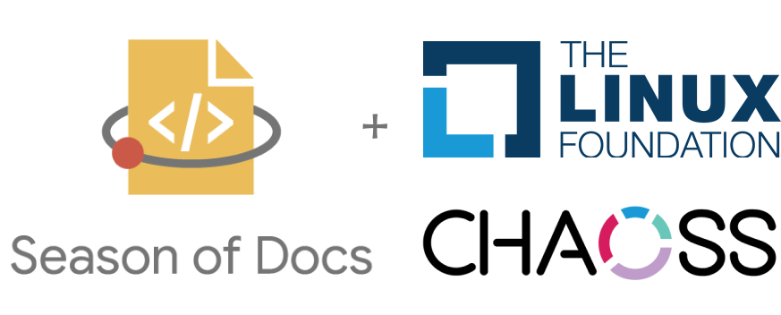

<h1 align="center">Google Season of Docs 2020 </h1>

<i>A full report on my Google Season of Docs 2020 work with CHAOSS Project under The Linux Foundation</i>

    
    <h2>
    Creating a <a href="https://github.com/chaoss">CHAOSS</a> Community-wide Handbook
    </h2>

	<a href="#project-abstract">Project Abstract</a> |
	<a href="https://github.com/vchrombie/gsoc/issues?q=is%3Aissue">Discussions</a> |
	<a href="#weekly-updates">Weekly Updates</a> |
	<a href="#links">Links</a>

### Project abstract
Currently, working groups within the CHAOSS community have developed their own ways of working and documented their disparate processes to varying degrees.
Working Groups includes Common Metrics WG, Diversity & Inclusion WG, Evolution, Risk, and Value working groups which have set up their own participating and working ways and adapted different ways of communication and work culture. These working groups in accordance with metrics have different focus areas and backgrounds which works for appropriate metrics lead various researches and development under respective working groups category and know the right pathway to lead various researches and development under respective categories but the processes for newcomers and existing contributors may not be known that how to participate or take the right path to for respective workings.
 As a result of this, the things within the CHAOSS community are not standardized. Therefore to know the right process and basic fundamentals of the work culture across the community, the goal of the community handbook is to centralize critical information and standardize parts of it across the CHAOSS project. The critical information and standardization parts majorly focus on the processes that CHAOSS uses so that CHAOSS have the agreement of how community accomplishes work, How newcomers can participate and follow the fundamentals of the community and what processes and pathway newcomers or existing members have to follow for availing the leadership within the CHAOSS community.

The handbook should serve as an instruction manual for existing and new community members on how to get work done in the CHAOSS project. This project involves a creative component of collecting and organizing content for the handbook as well as a technical component of defining how to represent the handbook.

**Mentors:** [Georg J.P.link](https://github.com/GeorgLink), [Matt Germonprez](https://github.com/GeorgLink), [Armstrong Foundjem](https://github.com/foundjem)

### Weekly Updates

#### Community bonding (August 17, 2020 - September 13, 2020)
* Week 1 - Weekly Summary: [Weekly Report](https://github.com/jaskiratsingh2000/Google-Season-of-Docs/blob/master/Reports/Community%20Bonding%20Phase/Week-1.md) | Blog Post: [Google Season of Docs: CHAOSS Project under The Linux Foundation — Week 1](https://medium.com/@jaskiratsingh2000/google-season-of-docs-chaoss-project-under-the-linux-foundation-week-1-4b793e2b52f9)
* Week 2 - Weekly Summary: [Weekly Report](https://github.com/jaskiratsingh2000/Google-Season-of-Docs/blob/master/Reports/Community%20Bonding%20Phase/Week-2.md) | Blog Post: [Google Season of Docs: CHAOSS Project under The Linux Foundation — Week 2]() `**PENDING**`:hourglass_flowing_sand:
* Week 3 - Weekly Summary: [Weekly Report]() | Blog Post: [Google Season of Docs: CHAOSS Project under The Linux Foundation — Week 3]() **YET TO BE DONE :hourglass_flowing_sand:**
* Week 4 - Weekly Summary: [Weekly Report]() | Blog Post: [Google Season of Docs: CHAOSS Project under The Linux Foundation — Week 4]() **PENDING :hourglass_flowing_sand:**

#### Doc Development (September 14, 2020 - November 30, 2020)
* Week 5 - Weekly Summary: [Weekly Report]() | Blog Post: [Google Season of Docs: CHAOSS Project under The Linux Foundation — Week 5]() **PENDING :hourglass_flowing_sand:**
* Week 6 - Weekly Summary: [Weekly Report]() | Blog Post: [Google Season of Docs: CHAOSS Project under The Linux Foundation — Week 6]() **PENDING :hourglass_flowing_sand:**
* Week 7 - Weekly Summary: [Weekly Report]() | Blog Post: [Google Season of Docs: CHAOSS Project under The Linux Foundation — Week 7]() **PENDING :hourglass_flowing_sand:**
* Week 8 - Weekly Summary: [Weekly Report]() | Blog Post: [Google Season of Docs: CHAOSS Project under The Linux Foundation — Week 8]() **PENDING :hourglass_flowing_sand:**
* Week 9 - Weekly Summary: [Weekly Report]() | Blog Post: [Google Season of Docs: CHAOSS Project under The Linux Foundation — Week 9]() **PENDING :hourglass_flowing_sand:**
* Week 10 - Weekly Summary: [Weekly Report]() | Blog Post: [Google Season of Docs: CHAOSS Project under The Linux Foundation — Week 10]() **PENDING :hourglass_flowing_sand:**
* Week 11 - Weekly Summary: [Weekly Report]() | Blog Post: [Google Season of Docs: CHAOSS Project under The Linux Foundation — Week 11]() **PENDING :hourglass_flowing_sand:**
* Week 12 - Weekly Summary: [Weekly Report]() | Blog Post: [Google Season of Docs: CHAOSS Project under The Linux Foundation — Week 12]() **PENDING :hourglass_flowing_sand:**
* Week 13 - Weekly Summary: [Weekly Report]() | Blog Post: [Google Season of Docs: CHAOSS Project under The Linux Foundation — Week 13]() **PENDING :hourglass_flowing_sand:**
* Week 14 - Weekly Summary: [Weekly Report]() | Blog Post: [Google Season of Docs: CHAOSS Project under The Linux Foundation — Week 14]() **PENDING :hourglass_flowing_sand:**
* Week 15 - Weekly Summary: [Weekly Report]() | Blog Post: [Google Season of Docs: CHAOSS Project under The Linux Foundation — Week 15]() **PENDING :hourglass_flowing_sand:**
